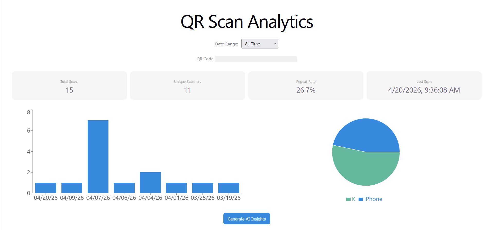
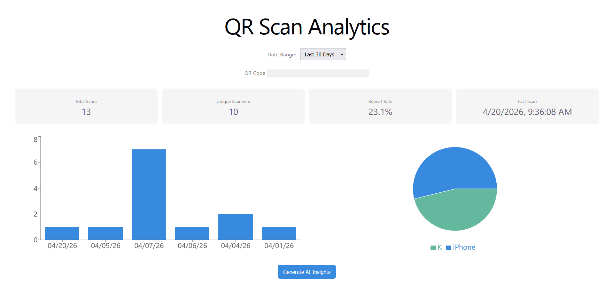
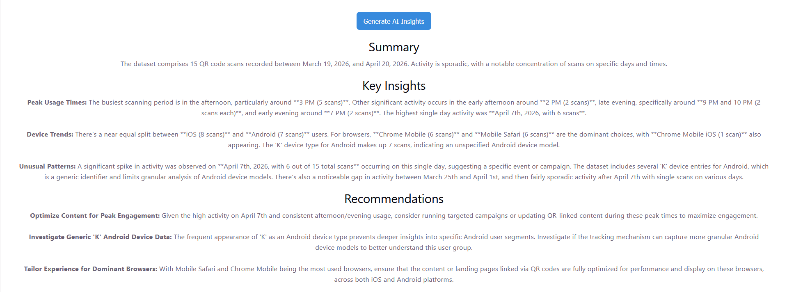
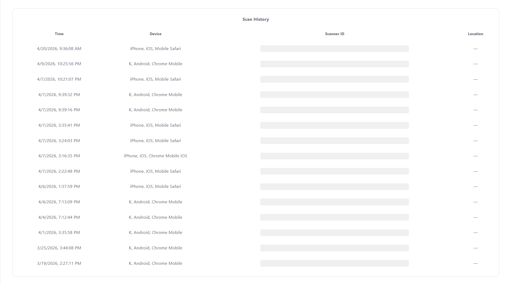

# QR Scan Analytics Dashboard

A full-stack web application for tracking, visualizing, and analyzing QR code scan activity, enhanced with AI-generated insights.

---

## Overview

The QR Scan Analytics Dashboard enables real-time monitoring of QR code usage through interactive data visualizations and AI-driven analysis. It integrates external scan data, processes it on the backend, and presents actionable insights through a responsive frontend interface.

---

## Screenshots

### Dashboard Overview


### Date Range Filtering (Last 30 Days)


### AI Insights


### Scan History


---

## Key Features

- Real-time QR scan analytics
- Aggregated metrics:
  - Total scans
  - Unique scanners
  - Repeat scan rate
  - Last scan timestamp
- Interactive visualizations:
  - Time-series bar chart
  - Device distribution pie chart
- Scan history table
- Date range filtering (7 days, 30 day, 90 days, all time)
- AI-generated insights based on scan activity
- Backend caching and rate limiting
- Secure rendering of AI output

---

## Tech Stack

**Frontend**
- React
- Recharts
- DOMPurify

**Backend**
- Node.js
- Express
- express-rate-limit
- node-fetch

**AI Integration**
- Google Gemini API (@google/genai)

**External Data Source**
- Hovercode API

---

## System Architecture

```
React (Frontend)
   ↓
Express API (Backend)
   ↓
Hovercode API (QR Scan Data)
   ↓
Google Gemini (AI Insights)
```

---

## Getting Started

### Prerequisites

- Node.js (v18+ recommended)
- npm

---

### Installation

#### 1. Clone the repository

```bash
git clone https://github.com/joec11/qr-scan-analytics.git
cd qr-scan-analytics
```

---

### 2. Install root dependencies

Install root dependencies from the root directory:

```bash
npm install
```

Start the application:

```bash
npm run dev
```

> This starts the backend first, followed by the frontend afterward.

---

#### 3. Backend Setup

```bash
cd qr-dashboard-server
npm install
```

Create a `.env` file in the `/qr-dashboard-server` directory:

```
HOVERCODE_API_TOKEN=your_token
QR_CODE_ID=your_qr_code_id
GEMINI_API_KEY=your_gemini_api_key
PORT=3001
```

Start the backend:

```bash
npm start
```

---

#### 4. Frontend Setup

```bash
cd qr-dashboard
npm install
```

Create a `.env` file in the `/qr-dashboard` directory:

```
VITE_API_URL=http://127.0.0.1:3001
```

Start the frontend:

```bash
npm run dev
```

---

## API Reference

### GET `/api/scans`

Returns filtered QR scan activity.

**Query Parameters**
- `range=7` (default)
- `range=30`
- `range=90`
- `range=all`

---

### POST `/api/insights`

Generates AI-driven insights based on scan data.

**Query Parameters**
- `range=7 | 30 | 90 | all`
- `t=<timestamp>` (optional, bypass cache)

---

## Security & Reliability

- AI-generated content is sanitized using DOMPurify to prevent XSS
- Rate limiting is applied to protect API endpoints
- Sensitive credentials are stored in environment variables
- Graceful error handling with fallback responses

---

## Performance Considerations

- AI responses are cached for 5 minutes per date range
- Dataset size is reduced before AI processing to improve performance
- Reusable backend functions reduce redundant API calls

---

## Limitations

- No persistent database (relies on external API)
- No authentication system
- AI availability depends on external service load

---

## Author

Joseph Candela

---

## License

This project is for educational and portfolio use.
